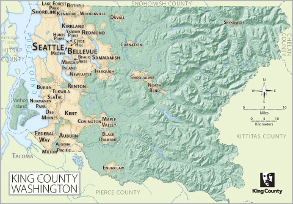

# Mutliple Linear Regression Modeling for King County Home Prices

<p>Phase 2 Project for Flatiron Online Data Science Bootcamp 

Prepared and presented by: Leah Pope (full time Data Science student)

Presentation URL: [here](thepdflink_tdb)

Presentation Video URL: [here](thevidlink_tbd)




# Introduction

The goal of this project is to answer questions about housing in King County, a county in Washington state. The main question to answer is can we predict housing prices in King County using the given dataset. I used multiple linear regression modeling to perform analysis on the provided dataset, kc_house_data.csv. I specifically wanted to explore X, Y, and Z.


# Data Description

Data Set Used:

* kc_house_data.csv
* list any procsessed datasets...
* would probably be a good idea to do so...

# Questions Explored
## Question 1: TBD
### Data used:
* dataset goes here
### [Notebook](./notebooks/link goes here)


## Question 2: TBD
### Data used:
* dataset goes here
### [Notebook](./notebooks/link goes here)


## Question 3: TBD
### Data used:
* dataset goes here
### [Notebook](./notebooks/link goes here)


<!-- toggle display style question format-->
<details><summary style="font-size: 20px"> Question 1: TBD?</summary>

#### Question Details
Para 1

para 2

para 3


</details>


# Results
Exploratory Data Analysis (EDA) and Results are in [Question 1](./notebooks/) [Question 2](./notebooks/) and [Question 3](./notebooks/) Jupyter Notebooks.


# Conclusions/Recommendations
The analysis leads to the following conclusions/recommendations around the home prices in King County.

* __Item1__  Blah blah blah

* __Item2__  Blah blah blah


# Next Steps/Future Work

Futher analysis into the following areas could yield additional insights.

* __Validate Waterfront NAN values__  I did a quick search for free APIs that would allow me to check the distance from lat/long coordinates to the nearest coastline. I did find a for-fee API [KB Geo's Distance to Coast Web Service](https://www.kbgeo.com/). It might be interesting/valuable to reverse geocode the lat/long of homes with Unknown/nan  __waterfront__  values and see if  any of them are actually waterfront properties.

* __Consider questions that county gov might ask__  I used the persona of "Scenic Home Buyers" to frame my stakeholder questions. A great future work idea is to use personas of King County government officals to frame stakeholder questions. I'm thinking specifically of Residential property tax assessors and county/city planning officals that want to learn about economic factors/data related to Residential property. Here are some example question I would like to explore:
    * Does my zip code price out residents? Does the city/county need to work on making homes more affordable?
    * Are lots too small/overcrowding/stressing infrastucture? Are there differences in lot size between zip codes?
    * Are the homes good quality/newer/renovated if older. Are there differences between zip codes in home quality?
    * What percentage of homes are being renovated? What types of homes (large/small/historic/older) are being renovated?
    * For property tax assessment purposes, exploring home living area and lot compared to neighbors. Are homes that are larger than neigbhoring homes getting a 'tax break' in being comparied to smaller properties?

*__Additional Scenic Home questions__ I would like to explore if there are differences between scenic homes and neighboring homes.
    * living area and lot size of scenic homes with their 15 nearest neighboring homes (_sqft_living15_ and _sqft_lot15_)
    * grade/condition of scenic homes with other homes in same zipcode


# For More Information
* Review the non-technical presentation [here](link
* View the non-technical presentation video [here](link)
* Read the blog..yikes! [here](link)
* Contact the author [Leah Pope](https://www.linkedin.com/in/leahspope/)


# Repository Structure
```
--notebooks
----1.ipynb
----2.ipynb
----3.ipynb
--data
----kc_house_data.csv
```